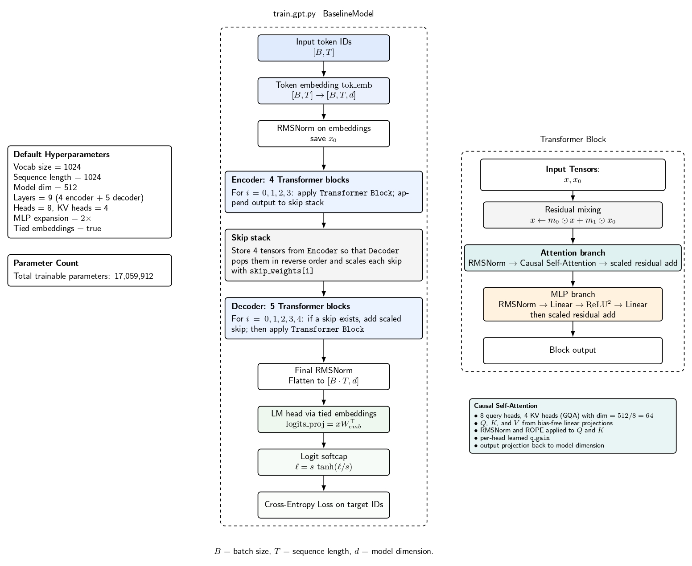

This project is done as part of the practical assessment for the course 30562 "Machine Learning and Artificial Intelliegence" at Bocconi University. 

# train_gpt.py model architecture

## Default model configuration
- vocab size: 1024
- sequence length: 1024
- transformer blocks: 9
- encoder blocks: 4
- decoder blocks: 5
- model width: 512
- attention heads: 8
- KV heads: 4 (GQA)
- MLP expansion: 2x
- tied embeddings: True

## Parameter count
I could not literally run the external `torchinfo` package in this container because it is not installed and the environment cannot fetch new packages. The count below is exact from instantiating the `GPT` class from `train_gpt.py` and summing `model.parameters()`.

**Total parameters: 17,059,912**

| Component | Parameters |
|---|---:|
| Token embedding | 524,288 |
| 9 transformer blocks total | 16,533,576 |
| Skip weights | 2,048 |
| Total | 17,059,912 |

### Per-block breakdown
| Subcomponent in one block | Parameters |
|---|---:|
| attn.c_q.weight | 262,144 |
| attn.c_k.weight | 131,072 |
| attn.c_v.weight | 131,072 |
| attn.proj.weight | 262,144 |
| attn.q_gain | 8 |
| mlp.fc.weight | 524,288 |
| mlp.proj.weight | 524,288 |
| attn_scale | 512 |
| mlp_scale | 512 |
| resid_mix | 1,024 |
| **One block total** | **1,837,064** |
| **9 blocks total** | **16,533,576** |

## Architectural notes
- The model is not a plain decoder-only GPT stack. It splits the 9 blocks into a 4-block encoder half and a 5-block decoder half, then reuses saved intermediate activations via learned skip weights.
- The attention uses grouped-query attention: 8 query heads and 4 KV heads.
- RoPE is applied to Q and K.
- The MLP is `ReLU^2` with shape `512 -> 1024 -> 512`.
- Because `tie_embeddings=True`, there is no separate learned `lm_head`; the embedding matrix is reused for output projection.