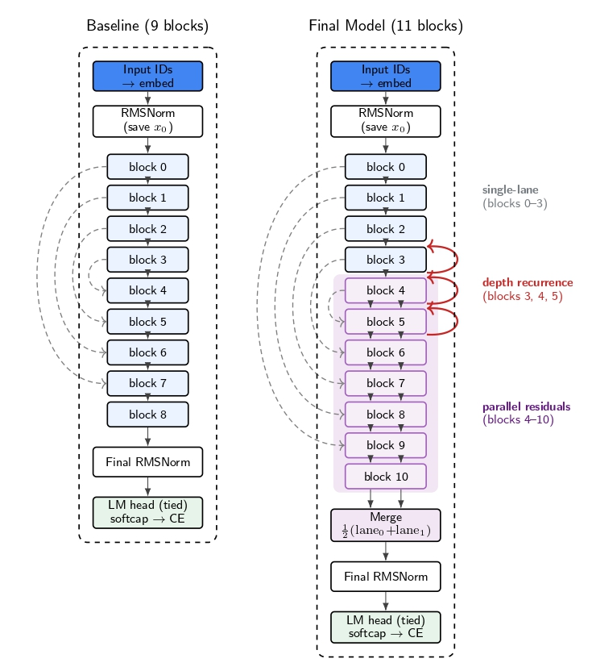

# <h1 align="center">*<ins>Ablation Study for the Parameter-Golf Challenge</ins>*</h1>



## Authors:
- Antonio Honsell (antonio.honsell@studbocconi.it)
- Andrea Lamonarca (andrea.lamonarca@studbocconi.it)
- Giulio Latora (giulio.latora@studbocconi.it)
- Matteo Mello Grand (matteo.mellogrand@studbocconi.it)
- Fabian Menekshi (fabian.menekshi@studbocconi.it)
- Kevin Shaqiri (kevin.shaqiri@studbocconi.it)

This repository contains the code, notebooks, and analysis for the Machine Learning and Artificial Intelligence course project at Bocconi University.

We tackle a particular variant of OpenAI's Parameter Golf Challenge: train a GPT language model under a fixed compute budget, compress the final model artifact under a strict memory budget, and minimise validation bits-per-byte (BPB) on a held-out FineWeb validation set.

In our setting, experiments are run for `5,000 iterations` on a single `NVIDIA A100 GPU`, and the final compressed artifact must fit within `16 MB`.

## Project summary

We improve the OpenAI naive baseline along two main directions:

1. **Architecture:** low-parameter-cost mechanisms that improve signal routing and effective depth.
2. **Quantization:** stronger compression through mixed-bitwidth quantization and quantization-aware training.

The final model combines:

- **Parallel Residuals (PR):** splits the residual stream into attention and MLP lanes after a chosen layer.
- **Depth Recurrence (DR):** re-runs selected mid-stack transformer blocks with shared weights.
- **Per-head Attention Output Gate:** learns a token-wise, head-wise scaling of attention outputs.
- **Mixed INT6/INT8 quantization + QAT:** uses INT6 for most matrices, protects sensitive/recurrent components with INT8, and adapts the model during late training.

## Main result

| Configuration | Validation BPB | Compressed size | Notes |
|---|---:|---:|---|
| Baseline GPT | 1.3101 +/- 0.0013 | 15.78 MB | OpenAI baseline adapted to our compute setting |
| + Parallel Residuals | 1.3057 +/- 0.0016 | 15.82 MB | Best L=9 PR configuration |
| + Depth Recurrence | 1.3022 +/- 0.0029 | 15.75 MB | Best L=9 DR configuration |
| + Attention Gate | 1.3058 +/- 0.0008 | 15.77 MB | Best standalone gate configuration |
| PR x DR | 1.2987 +/- 0.0028 | 15.80 MB | Pairwise architecture composition |
| PR x DR x Gate | 1.2927 +/- 0.0007 | 15.79 MB | Full L=9 architecture stack |
| **Final model** | **1.2812 +/- 0.0007** | **15.36 MB** | L=11 PR + DR + Gate + mixed quantization + QAT |

## Repository layout

```text
.
├── baseline_model.py
├── requirements.txt
├── notebooks/
│   ├── architecture_notebooks/
│   ├── quantization_notebooks/
│   └── final_model_notebooks/
└── src/
    ├── architecture/
    ├── quantization/
    └── final_model/
```

- `baseline_model.py` contains the baseline GPT training script.
- `src/architecture/` contains architecture ablation scripts.
- `src/quantization/` contains quantization experiments.
- `src/final_model/` contains the final combined model script.
- `notebooks/` contains analysis notebooks and plotting utilities.

For more detail, see:

- [`src/README.md`](src/README.md) for the code/scripts guide.
- [`notebooks/README.md`](notebooks/README.md) for the notebook guide.

## Installation

Create a virtual environment and install the dependencies:

```bash
python -m venv .venv
source .venv/bin/activate
pip install -r requirements.txt
```


## Data and tokenizer

The training scripts expect pre-tokenized FineWeb shards and a SentencePiece tokenizer. These files are not present in our repo, but can be easily downloaded from `https://github.com/openai/parameter-golf`

## Running experiments

Most scripts are configured through environment variables.

Run the baseline:

```bash
python baseline_model.py
```

Run the final model:

```bash
ITERATIONS=5000 \
TRAIN_BATCH_TOKENS=131072 \
SEEDS=1337 \
python src/final_model/train_gpt_combined_qat_emb.py
```

Useful environment variables:

| Variable | Purpose | Example |
|---|---|---|
| `DATA_PATH` | Directory containing tokenized FineWeb shards | `./data/datasets/fineweb10B_sp1024` |
| `TOKENIZER_PATH` | SentencePiece tokenizer path | `./data/tokenizers/fineweb_1024_bpe.model` |
| `SEEDS` | Comma-separated random seeds | `1337,42,123` |
| `ITERATIONS` | Number of optimization steps | `5000` |
| `TRAIN_BATCH_TOKENS` | Tokens per optimization step | `131072` |
| `VAL_LOSS_EVERY` | Validation cadence | `500` |
| `WANDB_PROJECT` | Optional Weights & Biases project | user-defined |

## Experiment map

### Architecture

Architecture scripts test:

- optimizer learning-rate and weight-decay sanity checks;
- parallel residual lanes;
- depth recurrence;
- attention output gates;
- compositions of validated mechanisms;
- attention residual variants;
- XSA as an additional, ultimately discarded, attention modification.

### Quantization

Quantization scripts test:

- INT4, INT6, and INT8 uniform quantization;
- per-channel vs per-tensor scaling;
- sensitive-layer and sensitive-tensor ablations;
- NF4, GPTQ, AWQ, and GPTQ+LQER variants;
- layer sensitivity studies;
- mixed-bitwidth quantization and QAT.

### Final model

The final model lives in:

```text
src/final_model/train_gpt_combined_qat_emb.py
```

It combines the selected architecture stack with mixed INT6/INT8 quantization and late quantization-aware training.

## Methodology notes

The project uses a fixed iteration budget rather than a wall-clock budget. This makes ablations easier to compare on a single A100 because every configuration receives the same number of optimizer updates, even if some mechanisms are slower per step.

The main metric is validation BPB. Lower BPB means better compression and better next-token modelling of the validation corpus.

## License

This repository is released under the MIT License. See [`LICENSE`](LICENSE) for details.